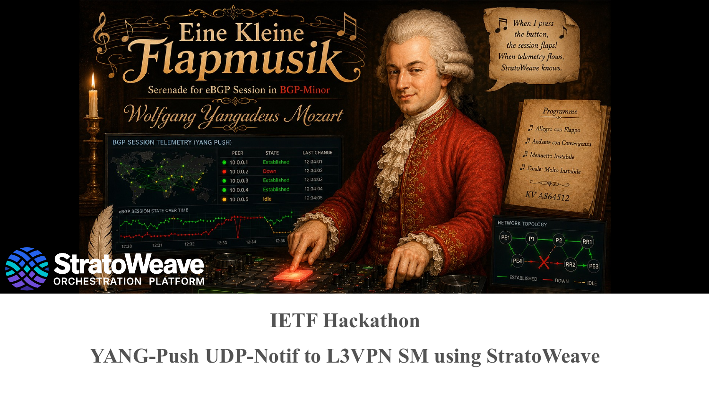
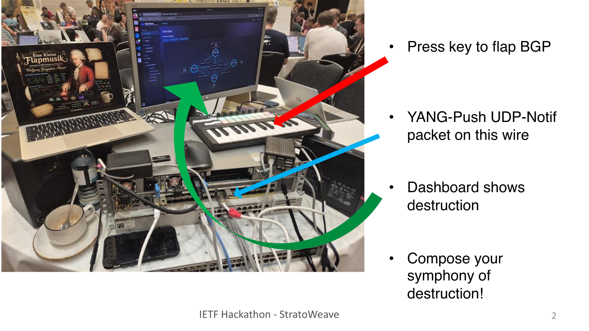
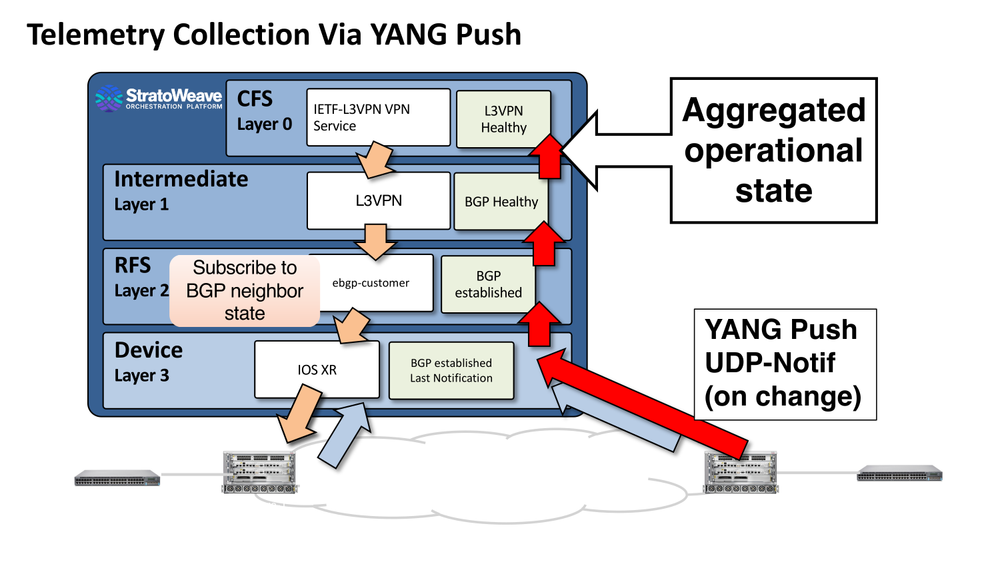
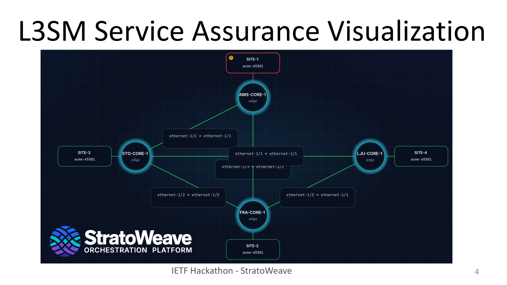

# flapmusik — YANG-Push UDP-Notif telemetry for IOS XR



`flapmusik` is a [StratoWeave](https://github.com/stratoweave) orchestration
application that configures Cisco IOS XR routers from intended state **and**
watches their live operational state by subscribing to YANG Push telemetry
delivered over UDP-Notif. It was built for the IETF 126 Hackathon
("YANG-Push UDP-Notif to L3VPN SM using StratoWeave") to exercise
[draft-ietf-netconf-udp-notif-25](https://datatracker.ietf.org/doc/draft-ietf-netconf-udp-notif/)
(UDP-based transport for configured subscriptions) end to end, and to feed the
resulting BGP session state up into an L3VPN service-assurance view (ONSEN /
[RFC 8299](https://www.rfc-editor.org/rfc/rfc8299) L3SM).

The demo is *Eine Kleine Flapmusik* — "Serenade for eBGP Session in BGP-Minor",
performed by Wolfgang Yangadeus Mozart. Press a key on a MIDI keyboard, flap a
real eBGP session, and watch the on-change notification race up the stack into
the dashboard. See [`yangadeus/`](yangadeus/) for the keyboard driver.



## Telemetry data flow

StratoWeave models a service as a stack of transform layers. Intended state
flows **down** (orange), turning an abstract service into device configuration;
operational state flows **up** (red), aggregating raw device notifications into
a single service health signal.



| Layer | Role | Down (intent → config) | Up (state ← notifications) |
| --- | --- | --- | --- |
| **CFS — Layer 0** | Customer-facing service | IETF L3VPN service | `L3VPN Healthy` |
| **Intermediate — Layer 1** | Network service | L3VPN | `BGP Healthy` |
| **RFS — Layer 2** | Resource-facing service | `ebgp-customer` | `BGP established` |
| **Device — Layer 3** | IOS XR device adapter | IOS XR config | `BGP established` — last notification |

The RFS layer is where the telemetry subscription is declared: for each eBGP
peer it *"subscribes to BGP neighbor state"* and turns the device's on-change
notifications into a per-peer `session-state`. That state is what the higher
layers roll up into `BGP Healthy` and finally `L3VPN Healthy`.

In code this lives in [`src/flapmusik/rfs.act`](src/flapmusik/rfs.act): the
`EbgpPeerTransform` actor declares one on-change `SubscriptionSpec` per peer
against the OpenConfig BGP `session-state` gather point and maps XR's raw state
(`ESTABLISHED`, `IDLE`, …) onto the service model's operational leaf.

## How UDP-Notif is used with IOS XR

flapmusik uses a **configured subscription** (not a dynamic RPC subscription): it
writes a YANG Push receiver + subscription into the router's running config over
NETCONF, and the router then streams notifications to flapmusik's UDP listener.
The IOS XR–specific wire adaptations live in the [StratoWeave
dependency](https://github.com/stratoweave/stratoweave) pinned in `Build.act`
([`src/xr_udp_notif.act`](https://github.com/stratoweave/stratoweave/blob/d22fdad1acc96a58ad1ae8229f55c329c98543c2/src/xr_udp_notif.act),
[`src/udp_notif.act`](https://github.com/stratoweave/stratoweave/blob/d22fdad1acc96a58ad1ae8229f55c329c98543c2/src/udp_notif.act),
[`src/udp_notif_receiver.act`](https://github.com/stratoweave/stratoweave/blob/d22fdad1acc96a58ad1ae8229f55c329c98543c2/src/udp_notif_receiver.act));
flapmusik declares *what* to watch and consumes the decoded result.

### 1. The subscription flapmusik configures on the router

Via NETCONF `<edit-config>`, using `Cisco-IOS-XR-um-yang-push-cfg`, flapmusik
installs a **receiver** and a **subscription** (each keyed entry written with
`xc:operation="replace"` so re-applying is idempotent):

```xml
<yang-push xmlns="http://cisco.com/ns/yang/Cisco-IOS-XR-um-yang-push-cfg">
  <receivers>
    <receiver>
      <receiver-name>stratoweave-&lt;sid&gt;</receiver-name>
      <transport><udp-notif>
        <max-segment-size>1232</max-segment-size>
      </udp-notif></transport>
      <address>&lt;receiver-address&gt;</address>   <!-- where XR sends datagrams -->
      <port>&lt;udp-port&gt;</port>
    </receiver>
  </receivers>
  <subscriptions>
    <subscription>
      <subscription-id>&lt;sid&gt;</subscription-id>
      <encoding><json/></encoding>                  <!-- YANG-JSON (RFC 7951) -->
      <filter><xpaths><xpath>
        <xpath-string>&lt;sensor path&gt;</xpath-string>
      </xpath></xpaths></filter>
      <source-interface>MgmtEth0/RP0/CPU0/0</source-interface>
      <update-policy><on-change><sync-on-start/></on-change></update-policy>
      <receivers><receiver>
        <receiver-name>stratoweave-&lt;sid&gt;</receiver-name>
      </receiver></receivers>
    </subscription>
  </subscriptions>
</yang-push>
```

- **`on-change` with `sync-on-start`** — the router sends a full snapshot on
  startup, then only the deltas as sessions change. (Periodic subscriptions are
  also supported, clamped to XR's ≥30 s minimum; the demo uses on-change.)
- **`source-interface`** — XR sources the UDP datagrams from its management
  interface so they are routable back to flapmusik's receiver address.
- **`encoding json`** — notifications arrive as YANG-JSON payloads.
- On teardown, flapmusik removes exactly the receivers/subscriptions it owns
  (name prefix `stratoweave-`) with `xc:operation="remove"`.

### 2. Sensor path and the IOS XR XPath dialect

The BGP session state is read from the **OpenConfig network-instance** tree,
not XR's native BGP model:

```
/network-instances/network-instance[name='DEFAULT']
  /protocols/protocol[identifier='BGP'][name='default']
  /bgp/neighbors/neighbor[neighbor-address='<peer>']/state/session-state
```

Two IOS XR 25.3.1 quirks are handled when rendering that XPath into XR's
configured-YANG-Push dialect (`to_xpath()` in
[`xr_udp_notif.act`](https://github.com/stratoweave/stratoweave/blob/d22fdad1acc96a58ad1ae8229f55c329c98543c2/src/xr_udp_notif.act)):

- **On-change only comes from OpenConfig.** XR's native BGP tree accepts
  cadence-based (periodic) telemetry but does **not** emit event-driven
  updates; only the OpenConfig BGP state path produces on-change events. So the
  subscription targets OpenConfig even though config is pushed with native
  models.
- **The identityref key predicate is dropped.** XR rejects the
  `protocol[identifier='BGP']` identityref half of the compound key in a
  configured filter. flapmusik omits *only* that predicate; the
  `name='default'` and `neighbor-address='<peer>'` string predicates stay on
  the wire, and the decoded protocol identity is still validated as BGP on
  receipt. XR's dialect also qualifies module boundaries by module name and
  drops XPath's leading slash.

### 3. Receiving and decoding

flapmusik's UDP listener implements the version-1 UDP-Notif wire format from
[draft-ietf-netconf-udp-notif-25](https://datatracker.ietf.org/doc/draft-ietf-netconf-udp-notif/):
a 12-byte fixed header (media type, publisher
ID, message ID), the segmentation option for reassembling datagrams larger than
`max-segment-size`, and a reassembly timeout. The YANG-JSON payloads are the
standard `ietf-notification` envelopes — `push-update` and `push-change-update`,
plus the `subscription-started` / `-terminated` / `-suspended` lifecycle
notifications. Message IDs are tracked so lost or out-of-sequence datagrams are
detected and can trigger a resync of the affected subscription. flapmusik logs
malformed, lost, and out-of-sequence notifications.

One XR deviation is normalized before schema-aware decoding: XR 25.3.1 emits the
OpenConfig protocol identityref as bare `BGP`, but
[RFC 7951](https://www.rfc-editor.org/rfc/rfc7951) requires a
cross-module identity to carry its module name, so it is rewritten to
`openconfig-policy-types:BGP` (narrowly, only on the network-instance/protocol
node).

### 4. Aggregating up the stack

The decoded per-neighbor `session-state` is published as the Device-layer
operational leaf and flows up the TTT layers: RFS (`BGP established`) →
Intermediate (`BGP Healthy`) → CFS (`L3VPN Healthy`) — the *aggregated
operational state* in the diagram above. The device subscription is on-change;
the internal layer-to-layer hops currently fall back to fast periodic
subscriptions because the TTT layer provider does not yet support on-change.

The CFS-layer state surfaces as an L3VPN (L3SM) service-assurance view, where a
flapped session lights up the affected site:



## Enabling it

UDP-Notif is off until you give flapmusik an address the router can reach it on.
The relevant flags:

| Flag | Default | Meaning |
| --- | --- | --- |
| `--udp-notif-receiver-address <addr>` | *(unset)* | Address IOS XR uses to reach flapmusik. **Setting it enables UDP-Notif.** |
| `--udp-notif-listen-address <addr>` | `0.0.0.0` | Local address the UDP listener binds. |
| `--udp-notif-source-interface <if>` | *(none)* | IOS XR interface the datagrams are sourced from (so they route back). |
| `--udp-notif-max-segment-size <n>` | `1232` | Max UDP-Notif datagram segment size. |

Example (from [`start.sh`](start.sh), a physical router on `10.99.0.13`):

```sh
out/bin/flapmusik --http-port 18080 --netconf-port 1830 \
  --udp-notif-listen-address 10.99.0.13 \
  --udp-notif-receiver-address 10.99.0.13 \
  --udp-notif-source-interface GigabitEthernet0/0/0/0 \
  r.xml
```

RESTCONF on `--http-port` exposes the aggregated service state; flapmusik itself
speaks NETCONF northbound on `--netconf-port`.

### Watching session state

The [`monitor`](monitor) script tails that aggregated state live: it polls
RESTCONF every 100 ms and prints one row per eBGP peer — router, peer address,
and current `session-state` — so you can watch sessions flap in real time. This
is the terminal view behind the MIDI demo.

```sh
./monitor
```

It expects flapmusik's RESTCONF on the default `http://127.0.0.1:18080` (the
`--http-port 18080` above) and needs `curl` and `jq`.

## Proven on real and virtual IOS XR

The same YANG-Push UDP-Notif path has been driven against both a hardware
router and a container, both running IOS XR 25.3.1:

- **Physical Cisco NCS 55A2 — [`test/xrd-bridge/`](test/xrd-bridge/).**
  A containerlab XRd is bridged (Linux `br-xrd`) onto the host's physical NIC,
  putting it on the same `10.123.0.0/24` L2 segment as a real NCS 55A2.
  flapmusik then subscribes to the physical box over that segment. `make start`
  then `./start.sh` from project root.
- **Virtual IOS XRd — [`test/ietf-hackathon-xrd/`](test/ietf-hackathon-xrd/).**
  A fully self-contained containerlab topology: one flapmusik-managed XRd
  (`xrd-a`), one external XRd peer (`xrd-b`), and a controller container, with
  25 eBGP sessions multiplexed over 802.1Q VLANs on a single link.
  `make start wait copy run`.

Because the on-device configuration and the UDP-Notif transport are identical in
both cases, the virtual lab is a faithful stand-in for the hardware.

## Repository layout

| Path | What it is |
| --- | --- |
| [`src/flapmusik/`](src/flapmusik/) | The flapmusik app: layer transforms (`layers/`), RFS logic (`rfs.act`), IOS XR device model bindings (`devices/`). |
| [`spec/`](spec/) | YANG models and the generator that produces the layer/device bindings. |
| [`test/ietf-hackathon-xrd/`](test/ietf-hackathon-xrd/) | Fully virtual XRd demo lab (25 eBGP sessions). |
| [`test/xrd-bridge/`](test/xrd-bridge/) | Lab that bridges XRd onto a physical NCS 55A2. |
| [`yangadeus/`](yangadeus/) | MIDI keyboard driver that flaps eBGP sessions to drive the demo. |
| [`docs/images/`](docs/images/) | Slides rendered from the hackathon deck. |

## Build

```sh
make            # optimized build  -> out/bin/flapmusik
make gen        # regenerate layer/device bindings from spec/ YANG
make test       # run the test suite
```
## References

- [draft-ietf-netconf-udp-notif-25](https://datatracker.ietf.org/doc/draft-ietf-netconf-udp-notif/) — UDP-based transport for configured subscriptions
- [RFC 8639](https://www.rfc-editor.org/rfc/rfc8639) / [RFC 8641](https://www.rfc-editor.org/rfc/rfc8641) — subscribed notifications / YANG Push
- [RFC 8299](https://www.rfc-editor.org/rfc/rfc8299) — YANG data model for L3VPN service delivery (L3SM)
- [RFC 7951](https://www.rfc-editor.org/rfc/rfc7951) — JSON encoding of YANG data
- [draft-kbf-onsen-problem-statement-00](https://datatracker.ietf.org/doc/draft-kbf-onsen-problem-statement/) — ONSEN (Operationalizing Network & SErvice abstractioNs)
